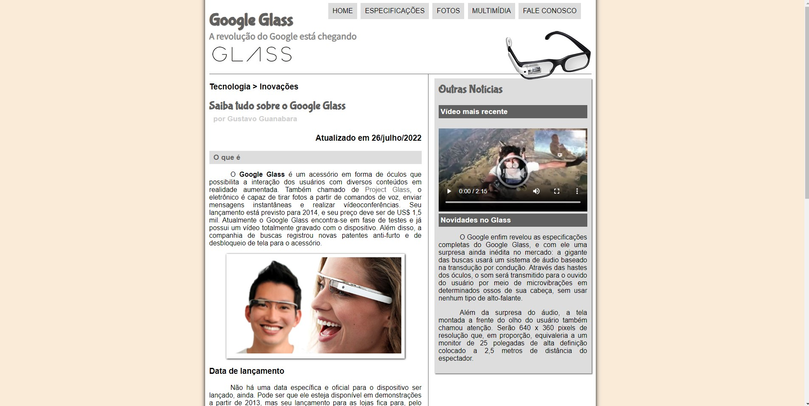
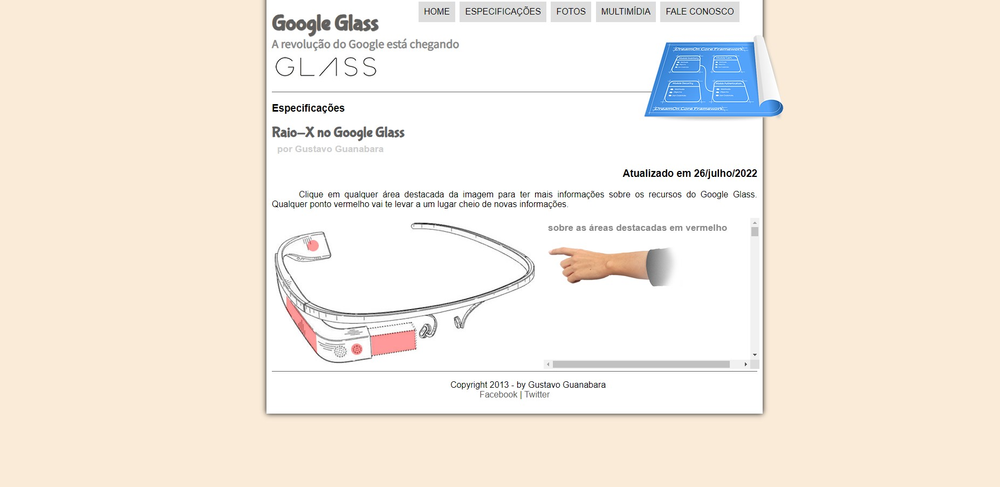
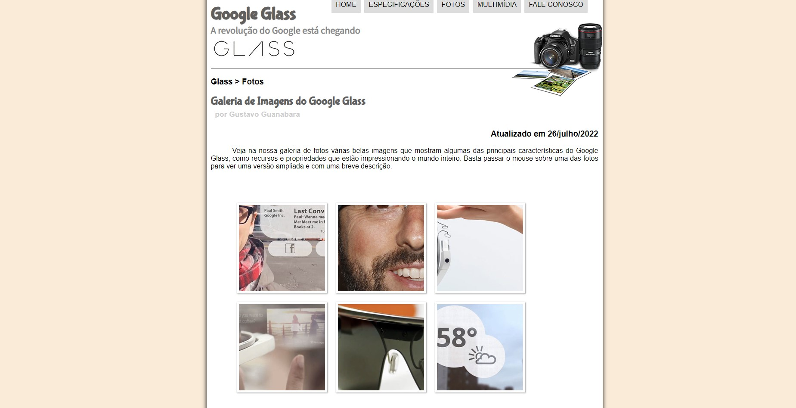
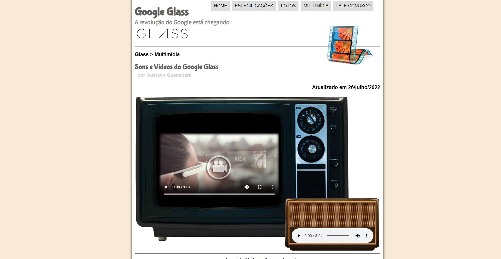
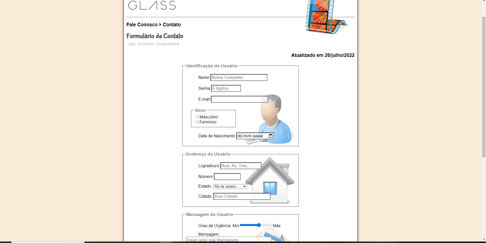

<h1 align="center"> Google Glass </h1>

Site do Google Glass desenvolvido no Curso em Video, com Gustavo Guanabara.  

 

  

  

  

  

  

## 🚀 Tecnologias

Esse projeto foi desenvolvido com as seguintes tecnologias:

- HTML e CSS
- JavaScript
- Git e Github

## 💻 Projeto

Aprendendo a desenvolver site do Google Glass com Gustavo Guanabara.

- [visite o projeto online] (https://gsilvaol.github.io/nlw-setup/)

